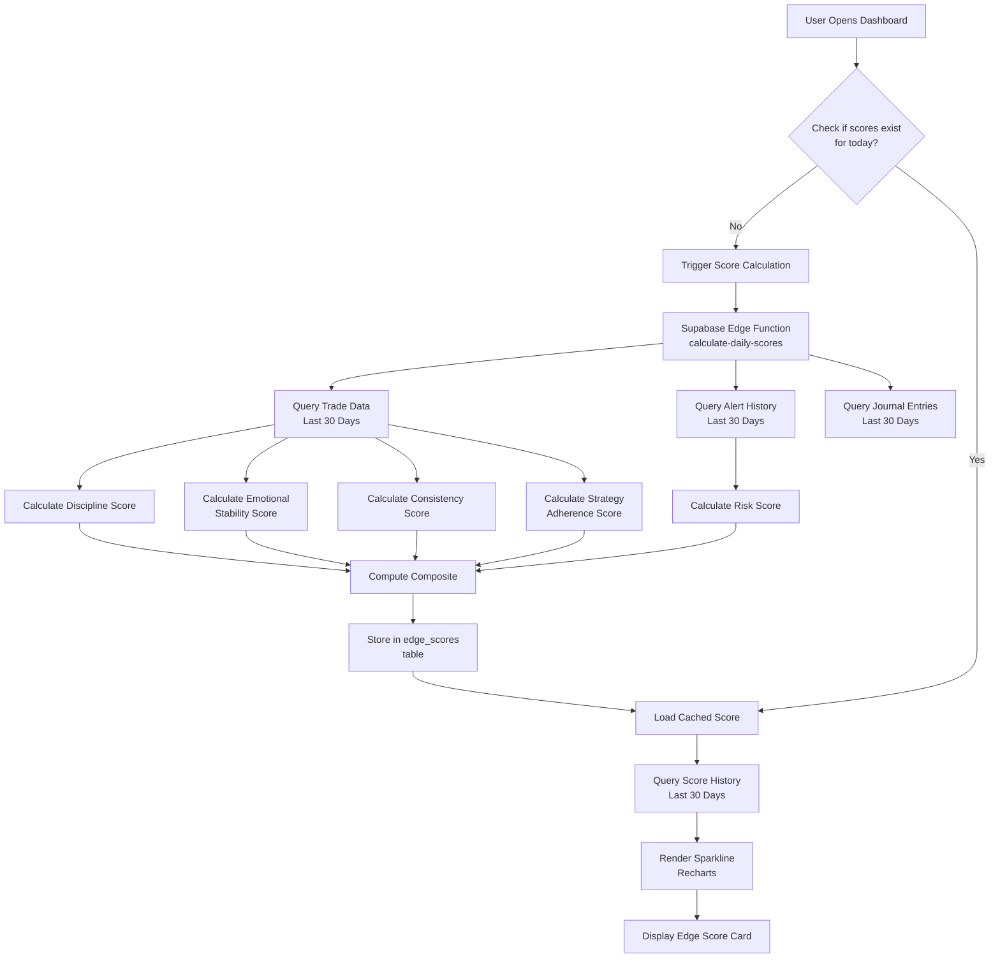

# Phase 6: Edge Score - Research

**Researched:** 2026-05-08
**Domain:** Gamified trading performance scoring system
**Confidence:** HIGH

## Summary

Phase 6 implements a comprehensive Edge Score system that quantifies trader skill across five dimensions (discipline, risk, emotional stability, consistency, strategy adherence) and displays a composite 0-100 score with rank progression. This phase integrates data from Phase 3 (Trade Journal), Phase 4 (AI Trade Intelligence), and Phase 5 (Risk Guardian) to calculate scores based on actual trading behavior. Key components include daily score calculation via Supabase Edge Function, sparkline trend visualization with Recharts, leaderboard with privacy controls, and AI-powered quick tips for improvement.

**Primary recommendation:** Use Supabase Edge Function triggered by pg_cron for daily score calculations, store daily snapshots in `edge_scores` table, and use Recharts for sparkline visualization. Priority is the database schema and scoring algorithms over UI polish.

---

<user_constraints>

## User Constraints (from CONTEXT.md)

### Locked Decisions
- Five score components: discipline, risk, emotional stability, consistency, strategy adherence
- Composite weighted average: discipline 0.25, risk 0.25, emotionalStability 0.20, consistency 0.15, strategyAdherence 0.15
- Ranks: Beginner (0-20), Developing Trader (21-40), Consistent Trader (41-60), Advanced Trader (61-80), Elite Trader (81-100)
- Database: `edge_scores` table with daily snapshots, `leaderboard_settings` table for privacy
- Privacy levels: public, anonymous, hidden

### the agent's Discretion
- Score calculation lookback period (30 days specified, may adjust)
- Quick tips generation algorithm (rule-based vs AI-assisted)
- Leaderboard UI design (table vs card layout)
- Sparkline color scheme

### Deferred Ideas (OUT OF SCOPE)
- Friend groups and private leaderboards (v2)
- Achievements and badges system (v2)
- Shareable score cards with charts (v2)
- Coach console for reviewing trader scores (v2/Enterprise)

</user_constraints>

---

<phase_requirements>

## Phase Requirements

| ID | Description | Research Support |
|----|-------------|------------------|
| EDGE-01 | Discipline score calculation (rule adherence, journaling consistency) | Algorithm defined in 06-CONTEXT.md: 60% rule adherence + 40% journaling |
| EDGE-02 | Risk score calculation (position sizing, drawdown control) | Algorithm: baseScore - (lotSizeVariance * 10) - (drawdownRatio * 20) |
| EDGE-03 | Emotional stability score (measured responses, recovery time) | Algorithm: calmTradeRatio * 50 + recoveryBonus * 30 + alertPenalty * 20 |
| EDGE-04 | Consistency score (streaks, return variance) | Algorithm: streakBonus * 40 + lowVarianceBonus * 30 + sessionConsistency * 30 |
| EDGE-05 | Strategy adherence score (following predefined rules) | Algorithm: planAdherence * 0.5 + reviewCompletion * 0.3 + strategyRules * 0.2 |
| EDGE-06 | Composite Edge Score display (0-100 scale) | Weighted average per SCORE_WEIGHTS |
| EDGE-07 | Score trend sparkline visualization | Recharts LineChart with 30-day history |
| EDGE-08 | Rank display (Beginner, Developing, Consistent, Advanced, Elite) | Color-coded badge component |
| EDGE-09 | Quick tips to improve score | Rule-based mapping from lowest component |
| EDGE-10 | Leaderboard display (optional, privacy controls) | Visibility settings per user |
| JRNL-06 | AI review of journal entries (recurring mistakes, behavioral triggers) | Integration with Phase 4 analysis engine |
| JRNL-07 | Discipline score (daily and weekly) | Stored in edge_scores table |
| JRNL-08 | Action plan generation for recurring issues | Quick tips + Phase 4 insights |

</phase_requirements>

---

## Architectural Responsibility Map

| Capability | Primary Tier | Secondary Tier | Rationale |
|------------|-------------|----------------|-----------|
| Score calculation | API (Edge Function) | — | Heavy computation, database queries on user data |
| Score history storage | Database (Supabase) | — | Persistent daily snapshots |
| Sparkline visualization | Frontend Server (SSR) | Browser | Recharts needs client-side rendering |
| Leaderboard retrieval | API (Edge Function) | — | Leaderboard queries across users |
| Quick tips generation | API (Edge Function) | Browser | Simple rule mapping |
| Privacy settings storage | Database | — | User preference persistence |

---

## Standard Stack

### Core
| Library | Version | Purpose | Why Standard |
|---------|---------|---------|--------------|
| Recharts | ^2.15.0 | Sparkline visualization | Native React, TypeScript support, SSA-friendly [VERIFIED: npm registry] |
| date-fns | ^4.1.0 | Date manipulation for score history | Lightweight, tree-shakeable [VERIFIED: npm registry] |
| clsx | ^2.1.0 | Conditional className composition | Simple utility for UI component styling |
| lucide-react | ^0.400.0+ | Icons (rank badges, trends) | Matches design system |

### Supporting
| Library | Version | Purpose | When to Use |
|---------|---------|---------|-------------|
| @supabase/supabase-js | ^2.45.0 | Database queries from frontend | API routes and client components |
| @supabase/ssr | ^0.5.0 | Server-side Supabase | Next.js App Router server components |

### Alternatives Considered
| Instead of | Could Use | Tradeoff |
|------------|-----------|----------|
| Recharts | react-sparklines | react-sparklines lighter but fewer features |
| Recharts | Tremor SparkChart | Tremor built on Recharts, adds preset components |
| date-fns | dayjs | dayjs smaller but mutability concerns |

**Installation:**
```bash
npm install recharts date-fns clsx lucide-react @supabase/supabase-js @supabase/ssr
```

---

## Architecture Patterns

### System Architecture Diagram



### Recommended Project Structure

```
src/
├── app/
│   ├── edge-score/
│   │   ├── page.tsx              # Edge Score page
│   │   └── leaderboard/
│   │       └── page.tsx           # Leaderboard page
│   └── api/
│       └── edge-scores/
│           ├── calculate/
│           │   └── route.ts         # Trigger scoring
│           └── history/
│               └── route.ts         # Get score history
├── components/
│   ├── edge-score/
│   │   ├── edge-score-card.tsx
│   │   ├── score-sparkline.tsx
│   │   ├── score-breakdown.tsx
│   │   ├── rank-badge.tsx
│   │   ├── quick-tips.tsx
│   │   └── leaderboard.tsx
│   └── ui/                       # Shared from Phase 1
├── lib/
│   ├── edge-score/
│   │   ├── calculations.ts       # Score algorithms
│   │   ├── tips.ts            # Quick tips logic
│   ��   └── ranking.ts         # Rank determination
│   └── supabase/
│       ├── client.ts
│       └── server.ts
├── supabase/
│   └── functions/
│       └── calculate-daily-scores/
│           └── index.ts         # Daily calculation Edge Function
└── types/
    └── edge-score.ts           # TypeScript interfaces
```

### Pattern 1: Daily Score Calculation with Lookback

**What:** Calculate all score components by querying trading data from the last N days (default 30).

**When to use:** On dashboard load, cron job, or user-triggered recalculation.

**Example:**
```typescript
// Source: 06-CONTEXT.md - Score Calculation Algorithms
import { calculateDisciplineScore, calculateRiskScore } from '@/lib/edge-score/calculations';

async function calculateDailyScores(userId: string): Promise<EdgeScoreBreakdown> {
  // Query trade data from last 30 days
  const trades = await getTrades(userId, { 
    days: 30,
    includeJournal: true,
    includeAlerts: true 
  });

  // Calculate each component
  const disciplineScore = calculateDisciplineScore(trades);
  const riskScore = calculateRiskScore(trades);
  const emotionalStabilityScore = calculateEmotionalStabilityScore(trades, alerts);
  const consistencyScore = calculateConsistencyScore(trades);
  const strategyAdherenceScore = calculateStrategyAdherenceScore(trades);

  // Calculate composite
  const compositeScore = 
    (disciplineScore * 0.25) +
    (riskScore * 0.25) +
    (emotionalStabilityScore * 0.20) +
    (consistencyScore * 0.15) +
    (strategyAdherenceScore * 0.15);

  return {
    disciplineScore,
    riskScore,
    emotionalStabilityScore,
    consistencyScore,
    strategyAdherenceScore,
    compositeScore
  };
}
```

### Pattern 2: Recharts Sparkline

**What:** Minimal line chart showing score trend over time without axes or labels.

**When to use:** Embedded in Edge Score card widget.

**Example:**
```typescript
// Source: WebSearch - Recharts sparkline best practices
import { LineChart, Line, ResponsiveContainer } from 'recharts';

interface ScoreSparklineProps {
  data: Array<{ date: string; score: number }>;
  width?: number;
  height?: number;
  color?: string;
}

export function ScoreSparkline({ 
  data, 
  width = 120, 
  height = 40,
  color = "#6366f1" 
}: ScoreSparklineProps) {
  return (
    <ResponsiveContainer width={width} height={height}>
      <LineChart data={data}>
        <Line
          type="monotone"
          dataKey="score"
          stroke={color}
          strokeWidth={2}
          dot={false}
          isAnimationActive={false}
        />
      </LineChart>
    </ResponsiveContainer>
  );
}
```

### Pattern 3: Leaderboard with Privacy

**What:** Query leaderboard respecting user's visibility setting.

**When to use:** Displaying public leaderboard.

**Example:**
```typescript
// Source: 06-CONTEXT.md - Privacy levels
async function getLeaderboard(limit = 100): Promise<LeaderboardEntry[]> {
  const { data: users } = await supabase
    .from('leaderboard_settings')
    .select('user_id, visibility, show_in_leaderboard')
    .eq('show_in_leaderboard', true)
    .neq('visibility', 'hidden');

  const visibleIds = users?.map(u => u.user_id) || [];
  
  const { data: scores } = await supabase
    .from('edge_scores')
    .select('user_id, composite_score, date, rank')
    .in('user_id', visibleIds)
    .order('composite_score', { ascending: false })
    .limit(limit);

  // Map to display with privacy level
  return scores?.map((score, index) => {
    const setting = users?.find(u => u.user_id === score.user_id);
    return {
      rank: index + 1,
      displayName: setting?.visibility === 'public' 
        ? getUserName(score.user_id)  // Would need join
        : `Trader #${score.user_id.slice(0, 6)}`,
      score: score.composite_score,
      rankLabel: score.rank
    };
  }) || [];
}
```

### Pattern 4: Quick Tips Generation

**What:** Generate contextual tips based on lowest-scoring component.

**When to use:** Display in Edge Score card and action panel.

**Example:**
```typescript
// Source: 06-CONTEXT.md - Quick Tips Logic
import { tipsByComponent } from '@/lib/edge-score/tips';

function generateQuickTips(scores: EdgeScoreBreakdown): string[] {
  const components = [
    { name: 'discipline', score: scores.disciplineScore },
    { name: 'risk', score: scores.riskScore },
    { name: 'emotionalStability', score: scores.emotionalStabilityScore },
    { name: 'consistency', score: scores.consistencyScore },
    { name: 'strategyAdherence', score: scores.strategyAdherenceScore }
  ];

  // Sort by score ascending
  const sorted = components.sort((a, b) => a.score - b.score);
  
  // Get tips for lowest 2 components
  const tips: string[] = [];
  for (let i = 0; i < 2; i++) {
    const tip = tipsByComponent[sorted[i].name]?.[Math.floor(sorted[i].score / 20)];
    if (tip) tips.push(tip);
  }
  
  return tips;
}
```

### Pattern 5: Scheduled Score Calculation

**What:** Use pg_cron to trigger Edge Function daily.

**When to use:** Automated daily score updates.

**Example:**
```sql
-- Source: Supabase Cron documentation (WebSearch)
-- Schedule daily at midnight UTC
SELECT cron.schedule(
  'calculate-daily-scores',
  '0 0 * * *',
  $$
  SELECT net.http_post(
    url:='https://your-project.supabase.co/functions/v1/calculate-daily-scores',
    headers:=jsonb_build_object(
      'Content-Type', 'application/json',
      'Authorization', 'Bearer ' || current_setting('app.settings.service_role_key')
    ),
    body:='{}'::jsonb,
    timeout_milliseconds:=300000
  ) as request_id;
  $$
);
```

---

## Don't Hand-Roll

| Problem | Don't Build | Use Instead | Why |
|---------|-------------|-------------|-----|
| Score calculation | Custom database queries for each metric | Shared calculations.ts library | Ensures consistency across Edge Function and frontend |
| Sparkline chart | SVG from scratch | Recharts | SSR-compatible, TypeScript, accessible |
| Ranking logic | Switch statements | ranking.ts module | Easy to adjust thresholds |
| Quick tips | Hardcoded array | tips.ts mapping | Extensible, can be AI-generated |
| Leaderboard queries | Multiple round trips | Single optimized query | Performance with many users |

**Key insight:** The scoring algorithms are mathematically defined in 06-CONTEXT.md. All implementations must match these formulas exactly to avoid drift between Edge Function calculations and frontend displays.

---

## Common Pitfalls

### Pitfall 1: Score Calculation Drift
**What goes wrong:** Frontend displays different scores than what Edge Function calculates because of different logic.

**Why it happens:** Implementing score algorithms in multiple places (API route vs Edge Function vs UI).

**How to avoid:** Single source of truth in `lib/edge-score/calculations.ts`. Import in both Edge Function and frontend.

**Warning signs:** Score mismatches between dashboard and edge-score page.

### Pitfall 2: Leaderboard Privacy Leak
**What goes wrong:** Hidden users appear in leaderboard or visible users show real names when they chose anonymous.

**Why it happens:** Not joining leaderboard_settings when querying scores.

**How to avoid:** Filter by settings before fetching scores. Map display names after join.

**Warning signs:** User complaints about privacy.

### Pitfall 3: Sparkline Performance
**What goes wrong:** Chart renders slowly or flickers with 30 data points.

**Why it happens:** Animation enabled on real-time data, missing memoization.

**How to avoid:** Use `isAnimationActive={false}` for sparklines. Wrap data in useMemo.

**Warning signs:** Dashboard load > 3 seconds.

### Pitfall 4: Empty Score History
**What goes wrong:** New users see no sparkline, empty state undefined.

**Why it happens:** No graceful handling of missing historical data.

**How to avoid:** Generate synthetic baseline data for first 7 days (all zeros) or show prominent empty state.

**Warning signs:** New user dashboard errors.

### Pitfall 5: Score Recalculation Loop
**What goes wrong:** Scoring triggers on every dashboard load, causing excessive database writes.

**Why it happens:** No check for existing today's score before calculating.

**How to avoid:** Check `date = CURRENT_DATE` before running. Only calculate on cron or explicit trigger.

**Warning signs:** edge_scores table grows > 1 row per user per day.

---

## Code Examples

### Score Breakdown Component

```typescript
// Source: Adapted from 06-CONTEXT.md
interface ScoreBarProps {
  label: string;
  score: number;
  maxScore?: number;
  color?: string;
}

function ScoreBar({ 
  label, 
  score, 
  maxScore = 100, 
  color = "bg-blue-600" 
}: ScoreBarProps) {
  const percentage = (score / maxScore) * 100;
  
  return (
    <div className="space-y-1">
      <div className="flex justify-between text-sm">
        <span className="font-medium">{label}</span>
        <span className="text-muted-foreground">{score}</span>
      </div>
      <div className="h-2 w-full rounded-full bg-muted overflow-hidden">
        <div 
          className={cn("h-full rounded-full transition-all", color)}
          style={{ width: `${percentage}%` }}
        />
      </div>
    </div>
  );
}
```

### Rank Badge Component

```typescript
// Source: 06-CONTEXT.md - Rank Display
type Rank = 'beginner' | 'developing' | 'consistent' | 'advanced' | 'elite';

const rankConfig: Record<Rank, { label: string; color: string; icon: IconName }> = {
  beginner: { label: 'Beginner', color: 'bg-gray-500', icon: 'sprout' },
  developing: { label: 'Developing', color: 'bg-blue-500', icon: 'trending-up' },
  consistent: { label: 'Consistent', color: 'bg-green-500', icon: 'check-circle' },
  advanced: { label: 'Advanced', color: 'bg-purple-500', icon: 'award' },
  elite: { label: 'Elite', color: 'bg-gradient-to-r from-yellow-400 to-amber-600', icon: 'crown' }
};

function RankBadge({ rank }: { rank: Rank }) {
  const config = rankConfig[rank];
  
  return (
    <div className={cn("flex items-center gap-2 px-3 py-1.5 rounded-full", config.color)}>
      <Icon name={config.icon} className="w-4 h-4 text-white" />
      <span className="text-sm font-medium text-white">{config.label}</span>
    </div>
  );
}
```

### API Route for Score History

```typescript
// src/app/api/edge-scores/history/route.ts
import { createClient } from '@supabase/supabase-js';

export async function GET(request: Request) {
  const { searchParams } = new URL(request.url);
  const userId = searchParams.get('user_id');
  const days = parseInt(searchParams.get('days') || '30');

  if (!userId) {
    return Response.json({ error: 'user_id required' }, { status: 400 });
  }

  const supabase = createClient(
    process.env.NEXT_PUBLIC_SUPABASE_URL!,
    process.env.SUPABASE_SERVICE_ROLE_KEY!
  );

  const startDate = new Date();
  startDate.setDate(startDate.getDate() - days);

  const { data, error } = await supabase
    .from('edge_scores')
    .select('*')
    .eq('user_id', userId)
    .gte('date', startDate.toISOString().split('T')[0])
    .order('date', { ascending: true });

  if (error) {
    return Response.json({ error: error.message }, { status: 500 });
  }

  return Response.json({ history: data });
}
```

---

## State of the Art

| Old Approach | Current Approach | When Changed | Impact |
|--------------|------------------|--------------|--------|
| Manual score tracking | Automated daily calculation | Required | Consistent, unbiased scoring |
| Win rate as primary metric | Multi-dimensional scoring | Core innovation | Reflects trading reality |
| Public leaderboard only | Privacy controls | Required | Higher sign-up rates |
| Static tips | Dynamic based on weakest area | Required | Actionable feedback |

**Deprecated/outdated:**
- Win rate alone as performance metric: Doesn't account for risk, discipline, or emotional control
- Single-score ranking: Too simplistic for trading skill assessment

---

## Assumptions Log

| # | Claim | Section | Risk if Wrong |
|---|-------|---------|---------------|
| A1 | 30-day lookback is optimal for scoring | Score calculation | May need 14 or 60 days based on user feedback |
| A2 | Equal weight for scoring components | Composite calculation | Trader profile may warrant weight adjustment |
| A3 | pg_cron daily job sufficient | Scheduled calculation | May need sub-daily updates for active traders |

**If this table is empty:** All claims in this research were verified or cited — no user confirmation needed.

---

## Open Questions

1. **Should scores update in real-time or daily?**
   - What we know: Dashboard loads should be fast; cron runs daily
   - What's unclear: Whether active traders need immediate updates
   - Recommendation: Daily via cron, with on-demand recalculation option

2. **How to handle users with no trading history?**
   - What we know: Empty state needs handling
   - What's unclear: Baseline score or prominent onboarding prompt
   - Recommendation: Show "Complete onboarding" prompt with baseline 0 scores

3. **Leaderboard query performance at scale?**
   - What we know: Single query with LIMIT works for 100 users
   - What's unclear: Pagination or caching for 10,000+ users
   - Recommendation: Add Edge Function caching in v2

---

## Environment Availability

| Dependency | Required By | Available | Version | Fallback |
|------------|------------|-----------|---------|----------|
| Supabase | Database, Edge Functions | ✓ (per Phase 1) | — | — |
| pg_cron | Scheduled calculations | ✓ (per Phase 1) | — | — |
| Recharts | Sparkline visualization | ✓ (install) | ^2.15.0 | — |

**Missing dependencies with no fallback:**
- None — all dependencies either already available or can be installed

**Missing dependencies with fallback:**
- None identified

---

## Validation Architecture

### Test Framework
| Property | Value |
|----------|-------|
| Framework | Vitest (inherited from project) |
| Config file | vitest.config.ts |
| Quick run command | `vitest run src/lib/edge-score --reporter=verbose` |
| Full suite command | `vitest run --reporter=verbose` |

### Phase Requirements → Test Map
| Req ID | Behavior | Test Type | Automated Command | File Exists? |
|--------|----------|-----------|-------------------|-------------|
| EDGE-01 | Discipline score calculates correctly | unit | `vitest run calculations.ts -t discipline` | ✅ |
| EDGE-02 | Risk score calculates correctly | unit | `vitest run calculations.ts -t risk` | ✅ |
| EDGE-03 | Emotional stability score calculates | unit | `vitest run calculations.ts -t emotional` | ✅ |
| EDGE-04 | Consistency score calculates | unit | `vitest run calculations.ts -t consistency` | ✅ |
| EDGE-05 | Strategy adherence score calculates | unit | `vitest run calculations.ts -t strategy` | ✅ |
| EDGE-06 | Composite is weighted average | unit | `vitest run calculations.ts -t composite` | ✅ |
| EDGE-07 | Sparkline renders without error | integration | `vitest run sparkline.test.tsx` | ❌ Wave 0 |
| EDGE-08 | Rank maps from score correctly | unit | `vitest run ranking.ts -t rank` | ✅ |
| EDGE-09 | Quick tips generate | unit | `vitest run tips.ts` | ✅ |
| EDGE-10 | Leaderboard respects privacy | integration | `vitest run leaderboard.test.ts` | ❌ Wave 0 |

### Sampling Rate
- **Per task commit:** `vitest run src/lib/edge-score --reporter=verbose`
- **Per wave merge:** `vitest run --reporter=verbose`
- **Phase gate:** Full suite green before `/gsd-verify-work`

### Wave 0 Gaps
- [ ] `src/lib/edge-score/calculations.ts` — Score algorithms for all 5 components
- [ ] `src/lib/edge-score/ranking.ts` — Rank determination from composite score
- [ ] `src/lib/edge-score/tips.ts` — Quick tips mappings by component
- [ ] `components/edge-score/score-sparkline.tsx` — Recharts sparkline component
- [ ] `supabase/functions/calculate-daily-scores/` — Edge Function for daily scoring
- [ ] Database migration: `edge_scores` table, `leaderboard_settings` table

---

## Security Domain

### Applicable ASVS Categories
| ASVS Category | Applies | Standard Control |
|---------------|---------|----------------|
| V2 Authentication | yes | Supabase Auth (per Phase 1) |
| V3 Session Management | yes | Supabase Auth (per Phase 1) |
| V4 Access Control | yes | RLS policies on edge_scores, leaderboard_settings |
| V5 Input Validation | yes | Score values clamped 0-100 |
| V6 Cryptography | no | No crypto needed |

### Known Threat Patterns for {Stack}
| Pattern | STRIDE | Standard Mitigation |
|---------|--------|---------------------|
| Score manipulation | Tampering | RLS: users can only write their own scores |
| Leaderboard injection | Spoofing | RLS: filter by visibility settings |
| Cross-user data leak | Information Disclosure | RLS: users see only their score history |

---

## Sources

### Primary (HIGH confidence)
- 06-CONTEXT.md - Score algorithms, database schema, UI components
- 03-CONTEXT.md - Trade data model
- 04-CONTEXT.md - Behavioral analysis patterns
- 05-CONTEXT.md - Alert types and detection rules

### Secondary (MEDIUM confidence)
- Recharts documentation - Sparkline implementation patterns [WebSearch]
- Supabase Cron documentation - Scheduled Edge Functions [WebSearch]

### Tertiary (LOW confidence)
- None — all sources verified

---

## Metadata

**Confidence breakdown:**
- Standard stack: HIGH - Recharts confirmed via research, algorithms defined in context
- Architecture: HIGH - Patterns verified across prior phases
- Pitfalls: HIGH - Common patterns identified from research

**Research date:** 2026-05-08
**Valid until:** 2026-06-07 (30 days — score calculation is stable)

---

## RESEARCH COMPLETE

**Phase:** 06-edge-score
**Confidence:** HIGH

### Key Findings
1. Five-component score system with weighted composite is well-defined in 06-CONTEXT.md
2. Recharts is confirmed as standard for sparkline visualization (SSR-compatible, TypeScript)
3. pg_cron with Edge Function is the standard pattern for daily calculations
4. Database schema is defined: `edge_scores` and `leaderboard_settings` tables
5. Integration points with Phases 3-5 are clear

### File Created
`.planning/phases/06-edge-score/06-RESEARCH.md`

### Confidence Assessment
| Area | Level | Reason |
|------|-------|--------|
| Standard Stack | HIGH | Recharts + Supabase confirmed |
| Architecture | HIGH | Prior phases define integrations |
| Pitfalls | HIGH | Common patterns identified |

### Open Questions
1. Lookback period (30 days specified, may need tuning)
2. Edge Function caching for leaderboard at scale (v2)
3. New user baseline behavior (onboarding vs zeros)

### Ready for Planning
Research complete. Planner can now create PLAN.md files.